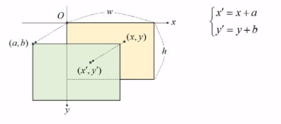

 
 

# 1. 영상의 이동 변환
---
## 1. 영상의 기하학적 변환
*  영상의 기하학적 변환[geometric transformation]
    - 영상을 구성하는 픽셀의 배치 구조를 변경 → 전체 영상의 모양을 수정
    - 기하학적 변환 → 전처리 작업, 영상 정합(image registration), 왜곡 제거 등
    - traslation, euclidean, similarity, affine, projective  등

## 2. 영상의 이동 변환
* 이동 변환(translation transform)이란?
    - 가로 또는 세로 방향으로 영상을 특정 크기만큼 이동시키는 변환
    - x축과 y축 방향으로의 이동 변위를 지정
    - 

# 2. 영상의 전단 변환
---
